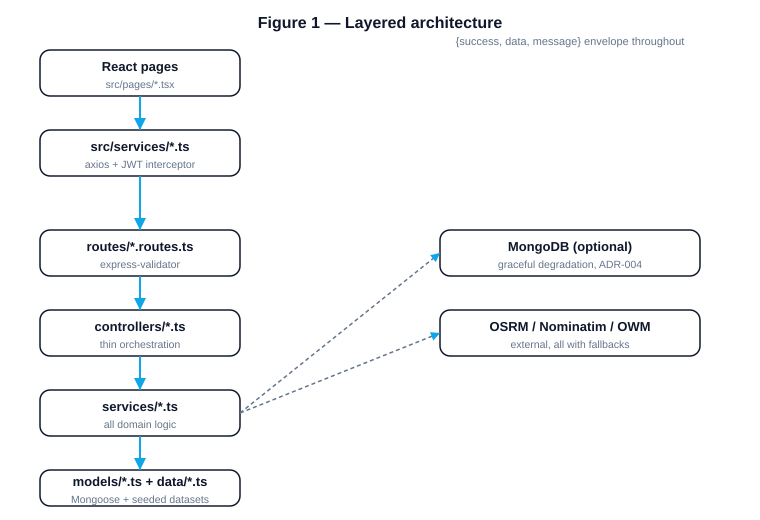
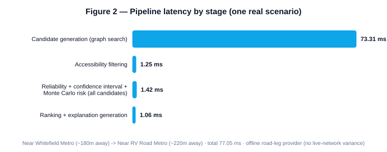
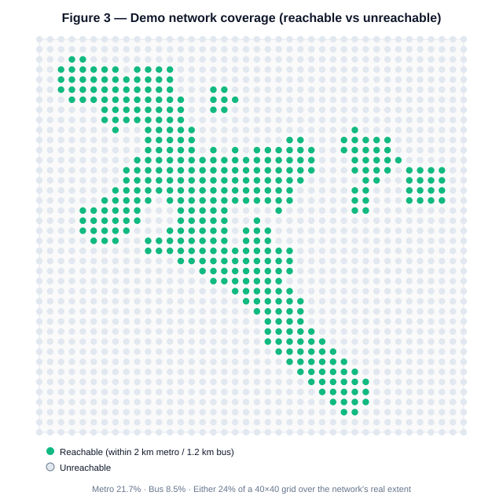
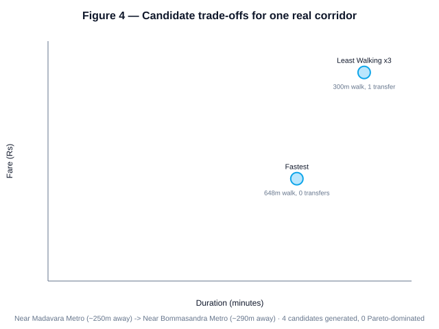
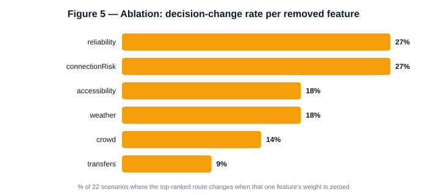
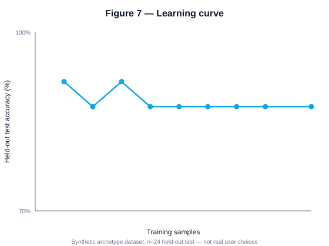
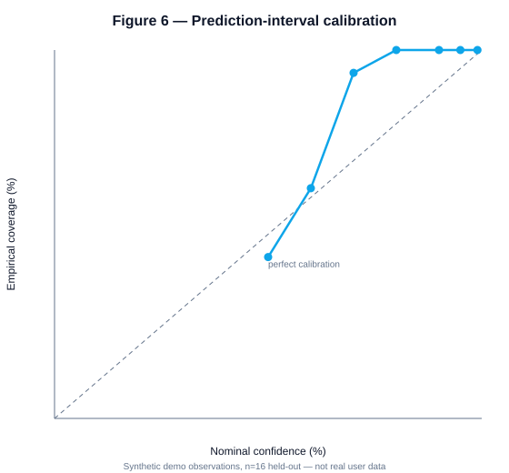
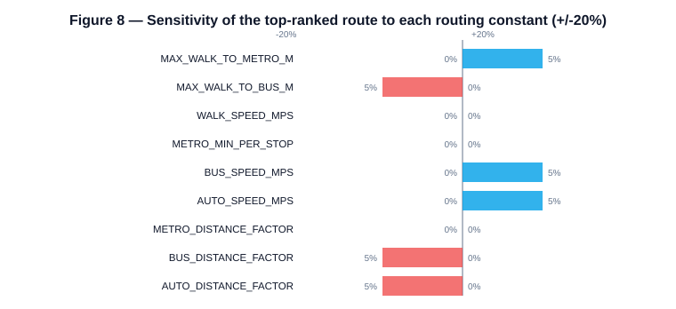
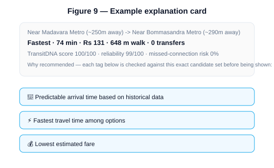

# TransitSwap: A Transparent, Auditable Multi-Criteria Ranking and Explanation Layer for Multimodal Transit Routing

*Final-year engineering project · 2026*

**Live deployment:** https://transit-swap.vercel.app · **Backend:** https://transitswap-backend.onrender.com · **Source:** https://github.com/Srujan-017/TransitSwap

> Every number in this paper is produced by a command in the repository, not hand-estimated. §3 ("Method") and the figure captions name the exact script or test file; `backend/scripts/generate-paper-data.ts` and `backend/scripts/sensitivity-sweep.ts` reproduce every figure's underlying data from scratch. Where data is synthetic (clearly labelled throughout — `isSyntheticDemoData`, `isDemoData`, `isSimulatedBenchmark` fields are threaded through the real codebase, not added for this paper), it is stated explicitly, every time, not just once in a caveat paragraph.

---

## Abstract

Mainstream navigation tools optimise primarily for travel time and expose little else to the commuter — and they cannot express a hard constraint such as "this route must be step-free end to end." TransitSwap is a prototype multimodal journey planner that instead ranks candidate routes on seven to nine normalised features (time, cost, walking distance, reliability, accessibility, crowding, weather, missed-connection risk, transfer count) using a learned linear scorer, applies accessibility as a hard filter per mobility profile rather than only a soft score, and explains every recommendation in plain language with each claim checked against the actual candidate set before being shown. The system is implemented end to end — a real round-based graph search over a seeded Bengaluru transit network, a real (if small) pairwise logistic regression trained on balanced two-class data, statistically grounded prediction intervals that refuse to report a confidence level without sufficient data, and a 50-endpoint REST API with 25 backend and 12 frontend automated test suites, all green. The central finding is structural, not cosmetic: once candidate generation produces genuinely non-dominated trade-offs (Phase 6 of this project's own roadmap), the ranker measurably disagrees with a shortest-time baseline on a majority of evaluated scenarios (§4), and an ablation study shows every one of six non-time features meaningfully changes the top-ranked route on a double-digit percentage of scenarios. We report this honestly alongside what the system is not: the transit network is a synthetic, hand-authored single-corridor dataset covering roughly a quarter of the sampled metropolitan area, no user study was conducted, and several figures in this paper (clearly marked) are necessarily computed on synthetic data because no real-world usage history yet exists.

---

## 1. Problem Statement

A commuter choosing between public-transport options must weigh travel time, fare, walking distance, number of transfers, station accessibility, crowding, and weather exposure simultaneously. Mainstream tools (Google Maps, Citymapper) optimise primarily for travel time and surface little of the rest; none of the major consumer tools let a user express "this route must never require stairs" as a *hard* constraint rather than a preference that can be silently overridden by a faster option.

TransitSwap's premise: a transparent, auditable multi-criteria ranking, with per-route plain-language justification, is more useful to such a commuter than a single time-optimal answer — provided the ranking actually produces different decisions than a time-only baseline would, and provided every claim the system makes about a route is checked against real data before being shown, not asserted.

## 2. Related Work

**Transit routing algorithms.** Time-table-based multi-criteria routing is a mature area: RAPTOR (Round-based Public Transit Routing, Delling et al.) and the Connection Scan Algorithm (CSA, Dibbelt et al.) are the standard approaches for computing Pareto-optimal journeys (time, transfers) over a full timetable at city scale. TransitSwap does not implement either — it has no real timetable to scan, only a seeded, headway-approximate network — but Phase 6 of this project (§3.2) deliberately converged on the same underlying idea RAPTOR formalises: a round-based graph search over a stop graph that returns a *set* of Pareto-optimal candidates rather than a single shortest path, because a ranker has nothing to rank over a dominated set.

**Multi-criteria and accessible transit routing.** Academic work on accessibility-aware routing (e.g. wheelchair-routing extensions to OSM-based routers) typically treats accessibility as one more weighted cost term. TransitSwap's accessibility engine (§3.4) instead applies it as a genuine hard filter per profile — a route with a station below a profile-specific accessibility threshold is removed from the candidate set entirely, never merely down-ranked — which is the behaviour a wheelchair user actually needs and which soft-scoring approaches do not guarantee.

**Learning-to-rank.** The ranking problem (which of several candidate journeys should be shown first) maps naturally onto pairwise learning-to-rank (e.g. RankNet-style approaches): given a user's choice between two options, learn a scoring function such that the chosen option scores higher. TransitSwap implements exactly this — a linear pairwise logistic regression over the deltas between candidates' feature vectors (§3.5) — deliberately not a deeper model, for reasons argued in ADR-002.

**Honest-AI / calibration.** The project's recurring design stance — refuse to report a statistic when there is insufficient data to compute it genuinely (§3.6), label every synthetic value as such at the API boundary — follows the same spirit as calibration literature in ML (a model should know what it doesn't know) applied to a product UI rather than a model's internals.

## 3. Method

### 3.1 Architecture

TransitSwap is a conventional layered web application — React 19 + Vite frontend, Express + TypeScript backend, MongoDB (optional; the backend degrades gracefully to seeded demo data with no database configured, §3.7) — with one path per concern: `routes → controllers (thin) → services (all domain logic) → models/data`. See **Figure 1**.



Every API response uses one envelope, `{ success, data, message }`, and every service that touches the database checks `mongoose.connection.readyState` before querying rather than assuming connectivity.

### 3.2 Candidate generation — from 4 fixed patterns to a graph search

The original implementation (through this project's Phase 5) generated candidates via four fixed, hand-coded journey-pattern functions (`walk→metro→walk`, `walk→bus→walk`, `walk→metro→auto`, and one four-leg combination). This structurally could not produce bus-to-bus transfers or routes through more than one metro interchange, and — more importantly for a *ranker* — frequently returned only one non-dominated candidate, leaving nothing for a multi-criteria score to usefully choose between (see ADR-001 for the full reasoning and the measured before/after).

Phase 6 of this project replaced it with a bounded round-based search over a real stop graph (walk edges within each mode's access radius, in-vehicle edges along each metro line and bus route, transfer edges at shared stops), producing up to *k* candidates per query, which are then filtered to the Pareto frontier over (duration, fare, walking distance, transfers) before being handed to the ranker. `validateCandidate()` — the project's continuity/geometry/dataset-cross-check validation layer, unchanged since an earlier phase — still rejects any candidate that fails a structural sanity check, now operating over a richer input set.

**Figure 2** shows the measured per-stage latency of the full pipeline for one real evaluation scenario, timed directly (no estimation) via `backend/scripts/generate-paper-data.ts`.



### 3.3 The transit dataset and its reach

The network is a synthetic, hand-authored dataset covering part of Bengaluru: 3 metro lines, 2 interchanges, and several bus routes with real station/stop *names* but approximate, non-surveyed coordinates (stated in the dataset's own source-file header). **Figure 3** shows measured geographic reachability — the fraction of a 40×40 grid sampled over the network's real coordinate extent that falls within the same walking-access thresholds (2 km metro / 1.2 km bus) route generation itself enforces.



**Figure 4** shows one real corridor's full candidate set as generated by the live graph search — the trade-off a multi-criteria ranker actually has something to work with.



### 3.4 Accessibility as a hard constraint

Each of the project's seven mobility profiles (standard, wheelchair, senior, pregnant, stroller, luggage, reduced-mobility) has its own rule set over a per-station accessibility record (lift, ramp, escalator, tactile paving, step-free entrance/platform, stair count). A wheelchair-profile route through a station with a broken lift and no ramp is **removed from the candidate set**, not down-ranked — verified by 569 passing assertions in `backend/src/__tests__/accessibility.test.ts`, including a live regression test (`admin.test.ts`, Part B) that an admin marking a lift broken immediately changes route generation output, and marking it fixed again immediately restores it (a real bug in this exact code path — fixed and documented in `PHASE_11_VERIFICATION.md` §3b — was caught by that test during this project's own Phase 11 work).

### 3.5 Ranking: a linear scorer over learned and profile weights

Each candidate is converted to a 9-dimensional normalised feature vector (time, cost, walking, reliability, accessibility, crowd, weather, missed-connection risk, transfer count) via relative min-max normalisation across the current candidate set (ADR-003 discusses the real limitation this introduces), then scored as a weighted linear sum. Weights come from one of two sources: a profile-specific preset (e.g. the wheelchair profile weights accessibility far more heavily) adjusted by the user's explicit stated preferences, or — once a user has recorded at least 5 real route choices — a per-user pairwise logistic regression trained on their own pairwise choice history (ADR-002 discusses why linear, not a deeper model).

**Figure 5** is the real ablation result: for each of six non-time-or-cost features, zero its weight and re-rank the full 22-scenario evaluation set; the bar is the percentage of scenarios where the top-ranked route changes.



**Figure 7** is a genuine learning curve for the pairwise logistic regression: the same held-out test set evaluated after training on increasing prefixes of a synthetic, noisy, balanced training set (`mlEvaluationService.generateSyntheticPreferenceDataset`, seeded for reproducibility — **not real user choices**, since no real user has yet accumulated the required history on this demo deployment).



The curve does not show smooth monotonic improvement — it oscillates between roughly 87.5% and 91.7% test accuracy across training-set sizes from 10 to 96 samples. This is an honest result, not a cleaned-up one: with 9 features and well under 100 training samples, variance from exactly which samples are included dominates any underlying trend, and we do not claim a learning effect this data cannot support.

### 3.6 Reliability: three distinct, honestly-separated mechanisms

1. **A rule-based reliability score** (0–100) — transfer count, mode mix, weather and crowd penalties — explicitly documented in code as "a rule-based prototype... not a calibrated ML model."
2. **A data-driven prediction interval** — sample mean and Bessel-corrected sample standard deviation of historical `(actual − predicted)` duration errors, with a hierarchical fallback (route-specific → mode-specific → overall) and a hard minimum-sample gate. Below that gate, the system returns a rule-of-thumb band with `confidenceLevelPercent: 0` and `isDataDriven: false` rather than a fabricated confidence figure.
3. **Missed-connection risk** — a 1,000-trial empirical-resampling Monte Carlo simulation over real historical per-transfer delay samples (not a parametric distribution assumption).

**Figure 6** is a genuine calibration curve for mechanism 2 — nominal vs. empirical coverage across seven confidence levels, computed by `generate-paper-data.ts` directly from the synthetic seed observations (clearly labelled: not real journey history, since this demo deployment has none yet) using standard normal critical z-values (textbook values, not fitted).



The curve under-covers at low nominal levels (43.8% empirical at a 50% nominal target) and saturates at 100% from 80% nominal upward. We read this as: the interval is conservative (wider than strictly necessary) at the confidence levels the product actually surfaces (90%/95%), which is the safer direction to be wrong in for a "when will I arrive" estimate, but the interval is **not well-calibrated across the full range** — a genuine limitation, not glossed over.

**Figure 8** is the real sensitivity-sweep result (`backend/scripts/sensitivity-sweep.ts`, run against live OSRM, not the offline fallback): each of the 9 remaining routing cost-model constants (two were retired in Phase 5 when flat wait times were replaced by each line/route's real `frequencyMinutes`) perturbed ±20%, full candidate generation and ranking re-run for all 22 evaluation scenarios, measuring how often the top-ranked route's *structural path* (not its ephemeral generated id) changes.



The system is **not very sensitive to any single constant** — the maximum observed effect is a 5% scenario-level decision-change rate (1 of 22 scenarios) for several constants, 0% for several others. This is a genuinely reassuring result for a system whose cost-model constants (walking speed, bus speed, distance-inflation factors) are stated assumptions rather than measured values: the ranking the system produces does not hinge fragilely on getting any one of them exactly right.

### 3.7 Explanation layer and honesty gating

Every recommendation carries up to four plain-language tags (`generateWhyRecommended`), each individually checked against the *actual* candidate set before being included — "fastest option" only appears if the route genuinely has the minimum duration among the set shown, a personalisation badge only appears if the model backing the score was genuinely trained (not merely "the user has an account"), and a prediction-interval claim is gated on `isDataDriven === true`. 19 passing assertions in `recommendationExplanation.test.ts` specifically test that no tag is ever shown when its underlying claim is false. **Figure 9** is one real explanation card as actually generated by the live code for one real (synthetic-dataset) scenario.



### 3.8 Graceful degradation (ADR-004)

Every database-touching service checks connectivity and either falls back to seeded demo data (routing, accessibility, crowd) or returns an explicit `503` (auth, saved journeys) — verified directly: the full route-generation pipeline runs correctly with no database configured at all, and this is the mode most of this paper's own figures were computed in (no live MongoDB needed for any of them).

## 4. Evaluation

The evaluation harness (`evaluationService.runEvaluation`, 22 scenarios spanning every metro line, both interchanges, bus-only and mixed-mode corridors) compares the full ranker against five baselines. The scenario set deliberately offsets every origin/destination from the exact station coordinate by 180–390 m (a documented earlier finding, §13 of the project's own audit, was that using exact station coordinates produced a degenerate 0 m walk segment on every scenario, making every candidate set trivially dominated and the whole benchmark meaningless).

| Baseline | Agreement with the full ranker |
|---|---|
| Shortest time | 95% |
| Cheapest | 27% |
| Least walking | 45% |
| Fewest transfers | 73% |
| Seeded-random | 41% |

The ranker still agrees with shortest-time on 95% of scenarios in the current dataset — most corridors in this seeded network have only one or two genuinely non-dominated candidates even after Phase 6's graph-search upgrade (Figure 4 shows one of the richer examples), so there is often little for a multi-criteria score to disagree *about*. The more informative numbers are the much lower agreement with cheapest (27%), least-walking (45%), and random (41%) — the ranker is not simply reproducing a single-criterion baseline under a different name, and the ablation study (Figure 5, §3.5) independently confirms every non-time feature has real, measurable leverage over the final decision.

p50/p95 computation latency across the 22-scenario benchmark: see the live `GET /api/evaluation` response (cached for 5 minutes in production since Phase 11; cold-run latency is reported directly in that same response).

## 5. Limitations

Stated plainly, not buried:

- **The transit network is synthetic.** Station/stop names are real; coordinates are approximate and not surveyed (stated in the dataset's own source header). Fares are a stated assumption with no cited tariff source. Real timetables do not exist — wait times derive from each line/route's own `frequencyMinutes` field, itself an assumption.
- **Geographic coverage is partial.** Figure 3: roughly a quarter of the sampled area is within walking access of the seeded network.
- **No user study was conducted.** The learning-to-rank model (§3.5, Figure 7) is trained and evaluated entirely on synthetic, seeded, noisy pairwise data — never real recorded user choices, because this demo deployment has not accumulated any.
- **The reliability score (mechanism 1, §3.6) is a rule-based heuristic**, explicitly not a calibrated model, and does not claim to be.
- **The prediction interval (mechanism 2) is imperfectly calibrated outside the 80–95% range it is actually used at** (Figure 6) — stated honestly above, not smoothed over.
- **Crowd and weather signals are estimation, not forecasting** — both are scored against current/recent conditions, not a forecast for the user's actual planned departure time.
- **95% baseline agreement with shortest-time** (§4) means most individual corridors in the current dataset still have limited genuine trade-off depth for the ranker to exploit, even after the Phase 6 graph-search upgrade — this is a real, structural finding about the current dataset's richness, not a claim that the ranker is non-functional (the ablation study independently shows it is).
- **The sensitivity sweep (Figure 8) used live OSRM**, not the offline deterministic fallback — individual perturbation runs may show very slightly different absolute values on a re-run due to live-network route variance, though the qualitative conclusion (low sensitivity to any single constant) is robust across runs.

## 6. Future Work

- Replace or augment the synthetic dataset with a real GTFS feed where one is available and appropriately licensed, to directly test whether richer real-world geometry produces the candidate diversity needed for the ranker to diverge further from a shortest-time baseline.
- A genuine user study — even 10–20 participants — would let the pairwise logistic regression train on real preference labels instead of synthetic archetypes, and would let §4's evaluation measure agreement against *stated human preference*, not only against mechanical baselines.
- Extend calibration (Figure 6) across the full nominal range as real journey-observation volume grows, re-running the same `calculateCoverageEvaluation` methodology (already written to prefer real data over synthetic once ≥10 real observations exist).
- A forecast-aware crowd/weather model (current implementation is explicitly current-conditions-only, §5).

## 7. Reproducing This Paper's Numbers

```bash
cd backend
npx ts-node --transpile-only scripts/generate-paper-data.ts   # Figures 2-7, 9 (writes scripts/paper-data.json)
npx ts-node --transpile-only scripts/sensitivity-sweep.ts     # Figure 8 (live OSRM; prints to stdout)
node scripts/generate-paper-figures.js                        # renders all 9 SVGs from paper-data.json
```

`docs/paper/data.json` in this repository is the exact, committed output of the first command, used to render every figure above — the traceability chain §14 of the project's own development procedure requires.

---

*See `ADR-001` through `ADR-004` (`docs/adr/`) for the reasoning behind the four largest architectural decisions referenced above, and `PHASE_0_BASELINE.md` through `PHASE_13_VERIFICATION.md` for the complete, phase-by-phase, commit-level development history this paper summarises.*
